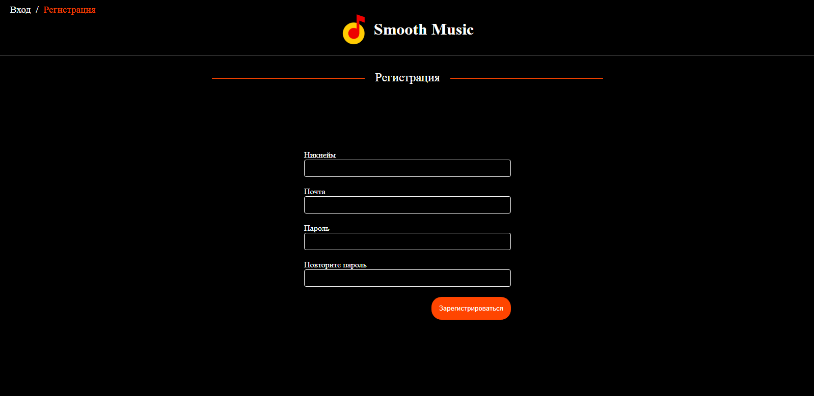

# Smooth Music

  
")  
## Overview
---
Smooth music - Стриминговый сервис с огромным количеством треков в библиотеке, музыкальными подборками и рекомендациями. Поддерживает синхронизацию текста с аудио. Также поддерживает перевод текста на русский язык.

---
## Images
SignUp page

Login page

User main page

Single Author page

Single Album page

---